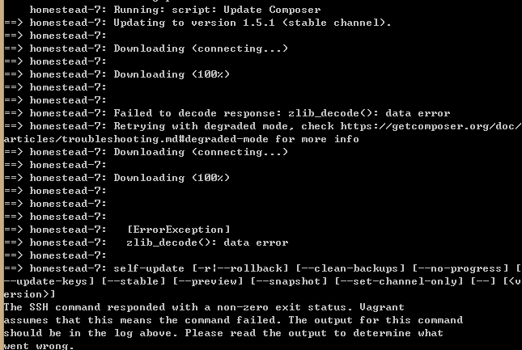

## Introduction  
本页面用于介绍在配置laravel环境时踩过的坑  

## laravel Homestead setup  

### Composer Update Error  

#### 现象  

如图，在执行`vagrant up`启动虚拟机时，自动更新`composer`，提示`data error`。  

#### 原因  
Composer的自动更新受到网络阻碍。  
切换composer镜像源(见后面参见)  

#### 参见  
- [在Windows下进行laravel配置](http://laravelacademy.org/post/354.html)  
- [laravel 5.4文档 - 开发环境 - Laravel Homestead](http://laravelacademy.org/post/6689.html)  
- [Packagist 镜像使用方法](https://pkg.phpcomposer.com/#how-to-install-composer)  
